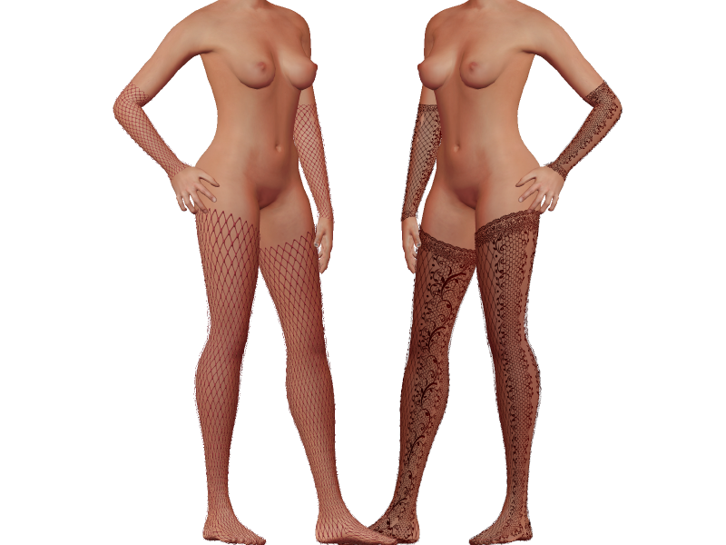

# **lingerie** Armsleeve02

* Author: Marco_105
* Category: Underwear
* Compatibility: 1.1.x
* License: CC0

I would share with you part of my job on that kind of clothes. I take some assets from here and adapt the texturing on it because i don't like too much modeling for now, I prefer find solution for unwraping and make texture.

So, you will found two assets for legs and arms that you can mix as you want.

For the fisnet one, you can adjust the color density in the 'Utilities' tab >Material Editor >AdditiveShading and save your own material.
I upload also a second white material for fishnet that you will find in the material part of the assets contribute.

Next, i will try some body 'lingerie' part most complete.

